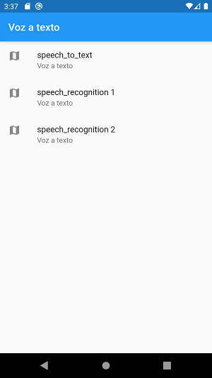
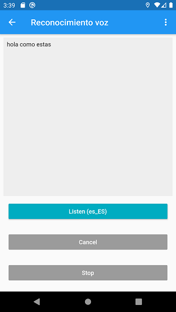
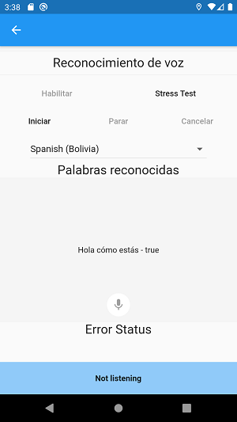

# vozatexto

    speech_to_text: ^2.1.0
    speech_recognition: ^0.3.0+1

## Observaciones

    se requiere version minima  minSdkVersion 21
    ruta <root>/android/app/build.gradle

    habilitar o tener instalado __google,__ desde playStore
    para reconocimiento de voz.

## Imagenes

    Menu
    

    speech_recognition
    

    speech_to_text
    
